# Tensorflow-Object-Detection-API-Tutorial-train-optimize
[Tensorflow Object Dectection API](https://github.com/tensorflow/models/tree/master/research/object_detection)를 사용해 특정 객체 검출에 특화된 Detection 모델을 만들 수 있는 Tutorial입니다. 

# Summary
우리는 종종 높은 정확도를 조금 양보하더라도 **빠르고(fast) 가벼운(light) Detection 모델**을 원합니다. 또한 수십 개의 객체를 검출하기 보단, **특정 객체 몇 개를 정확하고 빠르게 검출**하기를 원합니다. 예를 들어 도로위의 차량과 사람, 신호등만을 검출하길 원하거나 신용 카드의 숫자를 검출하는 모델을 원하는 경우입니다.

이 튜토리얼은 Tensorflow Object Detection API를 사용해 사용자가 원하는 특정 객체를 검출하는 빠르고 가벼운 모델을 만들 수 있도록 도와줍니다. 그럼에도 높은 정확도를 유지할 수 있는 방법도 알려줍니다.

본 튜토리얼은 신용 카드 숫자 검출 모델 생성을 예시로 설명을 진행합니다.

**개발 환경**
* Ubuntu 16.04
* Python 3.6.6
* Tensorflow 1.9.0
* cuda 9.0

# Table of contents
1. [설치(Install)](#Install)
2. [데이터셋(Dataset) 구성](#Dataset)
>* Step 1. [학습 데이터 준비](#Preparedata)
>* Step 2. [데이터 라벨링](#Datalabelling)
>* Step 3. [csv 파일 통합](#Mergecsv)
>* Step 4. [TF Record 파일 생성](#Maketfrecord)
>* Step 5. [object-detection.pbtxt 파일 생성](#Makepbtxt)
3. [학습(Training)](#Train)
4. [모델(Running)](#Running)
5. [결과(Result)](#Result)
6. [Extras](#Extras)

## 설치

[Tensorflow Object Dectection API](https://github.com/tensorflow/models/tree/master/research/object_detection)을 적당한 폴더에 git clone하고 [여기](https://github.com/tensorflow/models/blob/master/research/object_detection/g3doc/installation.md)를 참고하여 설치를 완료합니다. ( COCO API installation은 하지 않아도 튜토리얼을 진행하는데 문제는 없습니다. )

**본 튜토리얼의 대부분의 작업 및 명령어는 models/research/object_detection에서 실행됩니다.** 또한 아래와 같은 디렉토리 구조를 만들어 아래와 같은 순서대로 진행합니다.
* 데이터셋 구성
* 모델 학습
* 모델 구동

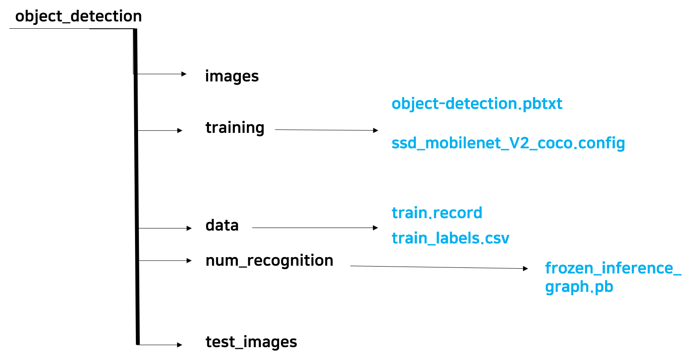

## 데이터셋 구성

### Step 1. 학습 데이터 준비

학습에 필요한 이미지 데이터를 준비하는 과정입니다. object_detection/training 폴더를 만들어 폴더에 학습에 필요한 이미지를 Google 검색을 통해 다운로드하거나, 가지고 있는 이미지 파일을 저장해 줍니다. 단, 이미지에는 검출하고자 하는 객체가 존재해야 합니다. 또한 [여기](https://github.com/tensorflow/models/blob/master/research/object_detection/g3doc/using_your_own_dataset.md)에서 알 수 있듯이 학습 시 사용할 이미지 데이터는 **RGB image로 jpeg나 png 포멧**이어야 합니다.

본 튜토리얼에서 사용한 데이터셋은 **.png 파일과 .csv 파일이 한 쌍 씩** 이루고 있는데, 여기서 **.png 파일은 학습할 이미지 데이터**이며, **.csv 파일에는 이미지 안에 존재하는 객체에 대한 정보**( class, x, y, width, height )가 저장되어 있습니다. 

> **.csv 파일의 생성에 대한 설명은 Step 2. 데이터 라벨링 목록에서 이어서 하게 됩니다.**

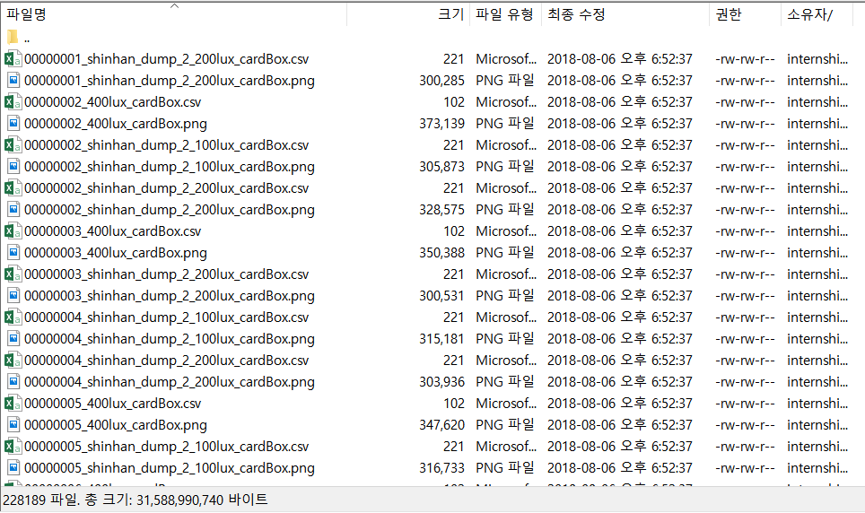

* 학습에 사용할 데이터셋 리스트

* 학습에 사용할 카드 이미지

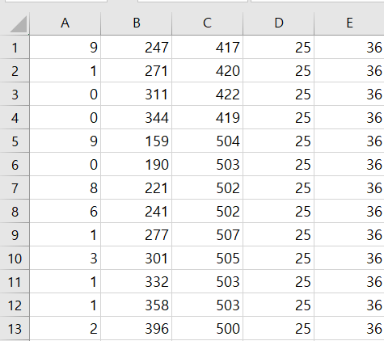

* 학습에 사용할 데이터셋의 csv 포멧( 왼쪽부터 객체의 **class(숫자), x, y, width, height** )

### Step 2. 데이터 라벨링

다음으로 Object Detection 모델을 학습하기 위해서는 이미지 데이터에 존재하는 객체에 **Labelling**을 하는 과정이 필요합니다. 이와 관련한 많은 프로그램이 존재하지만 이 튜토리얼에선 github에 open source로 공개되어 있는 LabelImg를 사용하길 추천합니다.

본 튜토리얼에서 제공받았다고 가정한 객체 정보는 .csv 파일로 존재하지만, 위 프로그램을 사용하여 라벨링을 진행했을 경우 결과는 XML 형식으로 얻게됩니다. 이는 [datitran](https://github.com/datitran/raccoon_dataset)의 github에 있는 xml_to_csv.py 소스를 사용해 간단하게 하나의 .csv 파일로 변경 가능합니다.

만약 본 튜토리얼처럼 라벨링 결과가 class, x, y, width, height의 순서대로 .csv 파일로 얻게된다면 아래 **Step 3. csv 파일 통합** 코드를 통해서 csv 파일을 Merge할 수 있습니다.

### Step 3. csv 파일 통합

xml_to_csv.py 소스를 사용해서 XML 파일을 csv파일로 만들었다면 약간의 소스 코드 수정을 통해 TFRecord 포멧에 맞는 하나의 통합된 csv을 얻게 되었을 것 입니다. 그러나 본 튜토리얼 데이터셋처럼 각 이미지 파일마다 csv 파일을 얻게 될 경우, TFRecord 파일을 생성하기 위해서 이를 하나의 통합된 csv 파일로 만들어줘야 합니다.

통합하는 과정에서 TFRecord 파일을 생성할 때 요구되는 포멧을 맞춰줘야 하는데, 이는 ( filename, width, height, class, xmin, ymin, xmax, ymax )입니다. 여기서 width와 height는 image의 사이즈이고, Labelling을 통해 얻은 width와 height는 bounding box의 사이즈이므로 혼동하지 않아야 합니다.  본 튜토리얼에서 제공하는 [소스코드](./docs/code/merge_csv.ipynb)를 통해 간단히 .csv 파일들을 포멧에 맞게 통합할 수 있습니다. 통합된 모습은 다음과 같습니다.

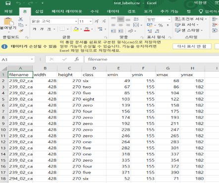

### Step 4. TF Record 파일 생성

Object Detection 모델을 학습시킬 때 마다 이미지와 .csv 파일을 한 쌍으로 데이터를 보관하고 이용하는 것은 비효율적이고 관리하기에도 좋지 않습니다. Tensorflow Object Detection API는 이를 해결하기 위해 이미지와 .csv 파일은 TFRecord라는 하나의 파일로 만드는 방법을 사용했습니다.

object_detection/data 폴더에 통합된 train_labels.csv 을 넣어줍니다. 그 후 아래 명령어를 실행해서 TFRecord 파일을 생성합니다.
> python3 generate_tfrecord.py --csv_input=data/train_labels.csv --output_path=data/train.record

이 과정은 제공되는 [소스코드](./docs/code/generate_tfrecord.py)를 object_detection 폴더에 넣은 후 사용하면 됩니다. 단, 사용자의 데이터에 맞게 아래 부분에 대해 수정이 필요합니다. 

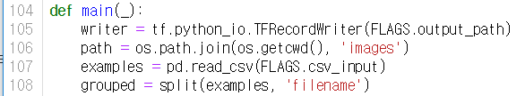

생성된 tfrecord 파일은 다음과 같습니다.

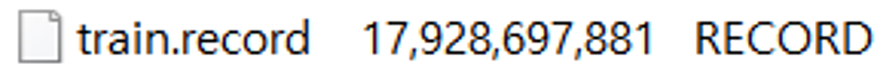

TFRecord에 대한 더 자세한 설명은 [여기](http://bcho.tistory.com/1190)를 참고하길 바랍니다.

### Step 5. object-detection.pbtxt 파일 생성

본 튜토리얼에서는 카드 숫자 검출을 위해 0 ~ 9의 10가지 숫자를 검출해야할 class로 지정했습니다. TFRecord 파일은 .pb 포멧으로 학습 시 데이터를 읽어 오는데, 여기서 label 정보 또한 .pbtxt형식으로 읽게 됩니다. 따라서 앞서 생성한 training 폴더에 [이것](./docs/code/object-detection.pbtxt)과 같은 object-detection.pbtxt를 만들어줘야 합니다.

## 학습

앞의 과정을 통해서 학습에 필요한 데이터를 수집하고, 라벨링하고, TFRecord로 변환하는 과정까지 모두 완료했습니다. 데이터가 모두 준비가 되었으니 이제 모델을 학습시킬 차례입니다. 학습에 앞서 Tensorflow Object Detection API는 사용자가 간단히 학습 환경을 변경할 수 있도록 object_detection/samples/configs에 .config 파일을 여러 개 준비해두었습니다. 우리는 좀 더 빠르고 정확한 모델을 학습시키기 위하여 [**ssd_mobilenet_v2_coco.config**](https://github.com/tensorflow/models/blob/master/research/object_detection/samples/configs/ssd_mobilenet_v2_coco.config) 파일을 복사하여 training 폴더에 넣어주고 아래 명령어를 통해 학습을 진행하도록 하겠습니다.

object_detection 디렉토리에서 아래와 같은 명령을 실행하여 학습합니다.
> python3 train.py --logtostderr --train_dir=training/ --pipeline_config_path=training/ssd_mobilenet_v2_coco.config

학습이 정상적으로 시작되면 아래와 같이 동작합니다.

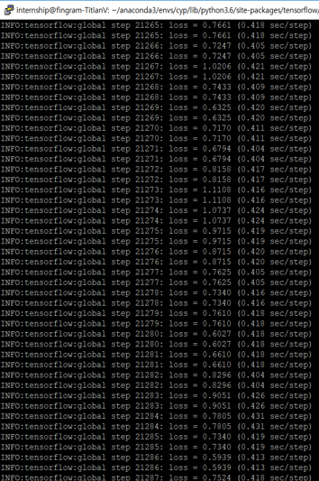

각 step마다 loss 값이 출력되고 잘 학습되는 경우 loss는 0에 수렴합니다. 적당히 loss가 0 ~ 2 정도로 수렴한다 싶으면 학습을 종료하고 모델을 테스트해봅니다.

## 모델 테스트

모델을 테스트하기 위해 학습을 종료하면 training 폴더에 많은 파일들이 생긴 것을 확인할 수 있습니다. 이를 객체 검출에 사용할 수 있는 즉 추론 모델을 추출하기 위해서 다음과 같은 명령어를 object_detection 폴더에서 실행합니다.
> python3 export_inference_graph.py \
 --input_type image_tensor \
 --pipeline_config_path training/ssd_mobilenet_v2_coco.config \
 --trained_checkpoint_prefix training/model.ckpt-xxxxx \
 --output_directory num_recognition
  
model.ckpt-xxxxx의 xxxxx부분에 저장된 모델 번호를 쓰고 명령어를 실행하면 num_recognition 폴더가 생성되었고 안에 frozen_inference_graph.pb(추론 모델)이 생성된 것을 알 수 있습니다.

모델을 적용하기 위하여 다음을 수정합니다. 

본 모델은 카드 번호 검출 모델이므로 model_name을 num_recognition으로 변경하고 PAATH_TO_CKPT도 바뀐 모델 경로로 변경합니다. PATH_TO_LABELS는 레이블에 사용되는 문자용 목록으로, 이전에 정의한 object_detection.pbtxt로 변경합니다. 마지막으로 여기서 정의한 클래스는 10개(0 ~ 9)이므로 NUM_CLASSES의 값을 수정합니다.  

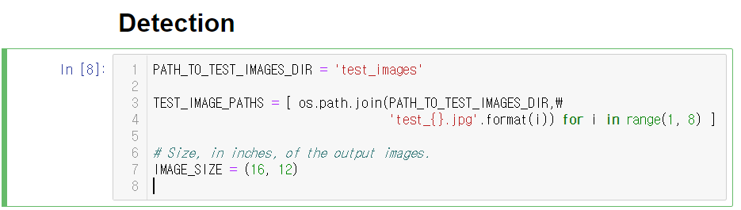

test_images 폴더 안의 이미지들을 test_{} 형식에 맞추어 불러옵니다. 

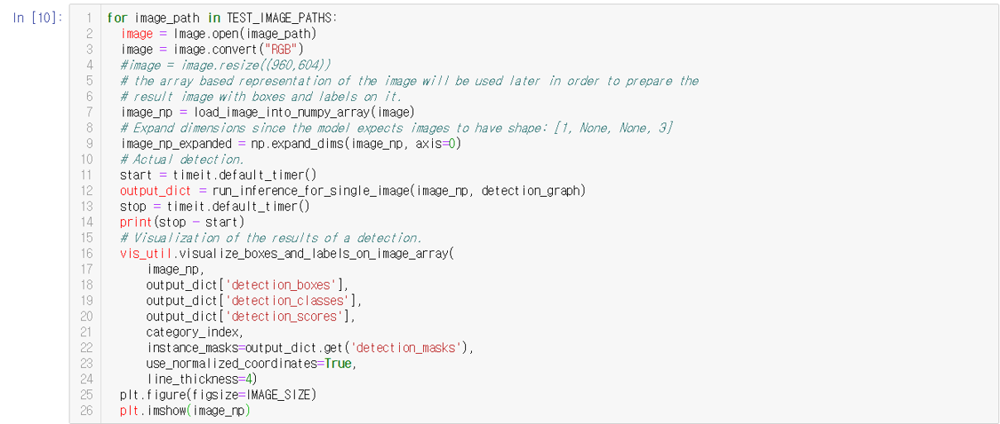

test_images의 이미지들은 흑백인데 컬러 이미지의 3개 채널로 넣어야 하기 때문에 RGB로 변환합니다. 

테스트를 하기 위해 테스트할 이미지를 object_detection/test_images 폴더에 업로드합니다.
업로드 후 object_detection_tutorial.ipynb를 실행하면 test_images 디렉토리의 이미지에 대해 num_recognition/frozen_inference_graph.pb을 사용하여 객체를 검출(추론)하고 그 결과를 출력합니다.

## 결과
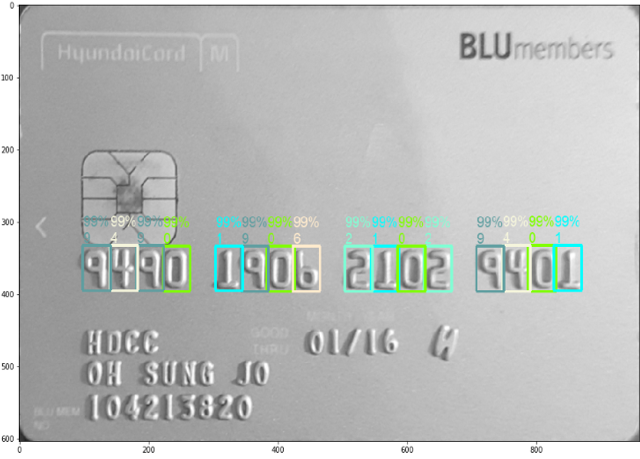
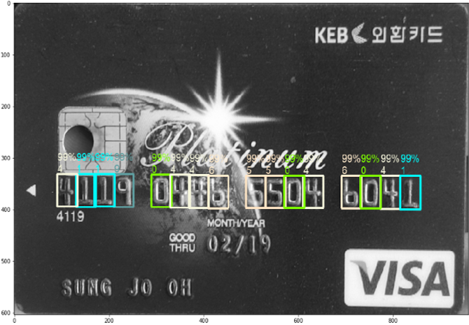

결과를 보면 학습이 잘 되어 카드 번호 검출이 잘 이루어지는 것을 알 수 있다. 
## Extras
